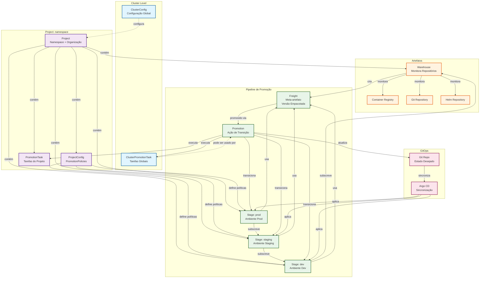

# Dominando a Promoção Contínua com Kargo: Um Guia Abrangente

## 1. Os Blocos de Construção: Custom Resource Definitions (CRDs) do Kargo

Para dominar o Kargo, é fundamental primeiro compreender seus blocos de construção: os Custom Resource Definitions (CRDs) do Kubernetes. Esses objetos são a base que permite ao Kargo modelar e executar pipelines de promoção de forma declarativa. Cada CRD representa um conceito central no processo de promoção, desde a origem dos artefatos até os ambientes de destino e as ações que os conectam.

A seguir, detalhamos os principais CRDs que compõem a arquitetura do Kargo:

* **ClusterConfig** (`clusterconfig`, `clusterconfigs`) - Descreve a configuração do Kargo em nível de cluster. É usado para definir configurações globais, como webhook receivers que se aplicam a todos os projetos no cluster, centralizando a integração com sistemas externos.

* **ClusterPromotionTask** (`clusterpromotask`, `clusterpromotasks`) - Define uma sequência reutilizável de etapas de promoção que está disponível para todos os projetos no cluster. Isso permite que equipes de plataforma criem fluxos de trabalho de promoção padronizados, que são então executados por um objeto Promotion.

* **Freight** - Representa um "meta-artefato" ou um conjunto de artefatos versionados (imagens de contêiner, commits de Git, charts Helm) que devem ser promovidos juntos. O Freight é a unidade de carga criada por um Warehouse que transita pelos Stages do pipeline.

* **ProjectConfig** - Define a configuração específica de um projeto, sendo sua função principal abrigar as PromotionPolicies. Essas políticas determinam se as promoções de Freight para Stages específicos são automáticas ou manuais.

* **Project** - Funciona como uma unidade de tenancy e um limite lógico para organizar recursos relacionados, como Warehouses, Stages e ProjectConfigs. Cada Project está associado a um namespace do Kubernetes, facilitando o gerenciamento de acesso via RBAC padrão.

* **Promotion** (`promo`, `promos`) - É a instância de uma ação de promoção, representando a transição de um Stage específico para um novo Freight. Esse objeto rastreia o estado do processo e executa os passos definidos em um PromotionTask ou ClusterPromotionTask.

* **PromotionTask** (`promotask`, `promotasks`) - Define uma sequência reutilizável de etapas de promoção dentro de um Project específico. Permite encapsular lógicas de promoção complexas (como clonar um repositório e atualizar um manifesto) em uma tarefa que pode ser referenciada por múltiplos Stages.

* **Stage** - Representa um alvo de promoção, geralmente mapeado para um ambiente (ex: desenvolvimento, homologação, produção). Os Stages recebem Freight e podem ser encadeados para formar um pipeline de promoção.

* **Warehouse** - É a fonte dos artefatos. Um Warehouse monitora repositórios (Git, imagens, Helm) em busca de novas versões e, ao encontrá-las, as empacota em um novo Freight para que possa entrar no pipeline de promoção.

Compreender como esses objetos se interconectam é o primeiro passo para desbloquear o potencial do Kargo. A seguir, exploraremos os conceitos operacionais de alto nível que esses CRDs representam.

## 2. O Ecossistema Kargo: Conceitos Fundamentais e Funcionalidades

O Kargo se posiciona como uma camada de orquestração de promoção que complementa, e não substitui, as ferramentas GitOps existentes como o Argo CD. Ele foi projetado para preencher uma lacuna crítica nos fluxos de trabalho de entrega contínua (CD), oferecendo uma solução declarativa para gerenciar o avanço de artefatos entre ambientes. Esta seção detalha os conceitos centrais que diferenciam o Kargo e resolvem os desafios dos pipelines de CD tradicionais.

### O Problema a Ser Resolvido: O "CI Kung Fu" e a Lacuna do GitOps

Muitas organizações, ao tentarem automatizar a promoção entre ambientes, recorrem ao que pode ser chamado de "CI Kung Fu": o uso excessivo de ferramentas de Integração Contínua (CI) e scripts personalizados para orquestrar tarefas de Entrega Contínua (CD). Essa abordagem representa um anti-padrão arquitetônico, pois desvirtua a finalidade das ferramentas de CI — projetadas para tarefas síncronas e de curta duração (construir, testar) — para gerenciar promoções, que são, por natureza, processos assíncronos e de longa duração (validar, testar em soak, aprovar). O resultado é um sistema complexo, frágil e de difícil manutenção.

Ferramentas como o Argo CD são excelentes na tarefa de sincronização — garantir que o estado de um cluster Kubernetes corresponda ao estado desejado em um repositório Git. No entanto, o Argo CD não possui um conceito nativo de promoção, ou seja, a lógica para atualizar o estado desejado de um ambiente com base no estado validado de outro. Essa lacuna frequentemente leva as equipes a criar automações frágeis. O Kargo foi criado exatamente para preencher essa lacuna, oferecendo uma plataforma dedicada à orquestração de promoções.

### Os Pilares do Kargo

O Kargo estrutura o processo de promoção contínua em torno de quatro conceitos principais, que juntos formam um pipeline lógico e declarativo.

#### O Warehouse: A Origem dos Artefatos

O Warehouse é a entidade que atua como ponto de partida do pipeline. Sua função é monitorar repositórios de artefatos — como registros de imagens de contêiner, repositórios Git ou repositórios de charts Helm — em busca de novas versões. Assim que uma nova versão é detectada (ex: uma nova tag de imagem v1.2.1), o Warehouse a registra para promoção.

#### O Freight: A Carga a Ser Promovida

Freight é um "meta-artefato" que agrupa versões específicas de múltiplos artefatos (imagens, commits, charts) que devem ser promovidos juntos como uma unidade coesa. Uma analogia eficaz é a logística de um varejista online: "Se você pede vários itens e o centro de distribuição os embala juntos em uma única caixa, você tem a garantia de que esses itens permanecerão juntos durante todo o processo de envio. Essa é uma analogia sólida de como o freight funciona no Kargo." Quando o Warehouse descobre novos artefatos, ele os agrupa em um novo Freight, garantindo que todas as peças de uma nova versão viajem juntas pelo pipeline.

#### O Stage: O Destino da Promoção

Um Stage representa um destino de promoção, tipicamente mapeado para um ambiente como dev, staging ou prod. Cada Stage define qual Freight deve ser implantado e como essa implantação deve ocorrer. Os Stages podem ser encadeados, onde um Stage "downstream" (ex: prod) se inscreve em um Stage "upstream" (ex: staging), formando um pipeline que define o fluxo de promoção.

#### A Promotion: O Processo de Avanço

A Promotion é a ação de transicionar um Stage para usar um novo Freight. É um objeto que representa e rastreia o processo de atualização do estado desejado de um ambiente, executando um conjunto de etapas definidas, como atualizar um arquivo de valores Helm no Git.

### Promoção vs. Implantação: Uma Distinção Crucial

É crítico para qualquer arquiteto de plataforma entender a diferença entre "promoção" e "implantação" no contexto do Kargo.

* **A promoção** é responsabilidade do Kargo. Ela consiste em atualizar o estado desejado de um ambiente, o que geralmente significa fazer um commit em um repositório Git para alterar a versão de uma imagem ou a configuração de um chart Helm.

* **A implantação** (ou deployment) é responsabilidade de um agente GitOps, como o Argo CD. Ela consiste em sincronizar o estado do cluster Kubernetes para que ele corresponda ao estado desejado recém-atualizado no repositório Git.

O Kargo orquestra a promoção de forma inteligente, enquanto o Argo CD executa a implantação de forma confiável. Juntos, eles formam uma solução GitOps completa e robusta. Com esses conceitos estabelecidos, podemos agora observar como eles se unem para orquestrar um fluxo de trabalho na prática.

## 3. Kargo em Ação: Orquestrando um Fluxo de Trabalho GitOps

Esta seção demonstra, passo a passo, como os conceitos do Kargo se unem para automatizar e gerenciar o ciclo de vida de uma aplicação. Veremos como o Kargo orquestra o fluxo desde a descoberta de um novo artefato até sua promoção segura através de múltiplos ambientes, integrando-se perfeitamente com o Argo CD.

### A Anatomia de uma Promoção

Um fluxo de promoção típico com Kargo e Argo CD segue uma sequência de eventos bem definida:

1. **Descoberta**: O Warehouse do Kargo, monitorando um registro de contêineres, detecta uma nova tag de imagem (ex: v1.2.0) enviada por um pipeline de CI.

2. **Criação do Freight**: Com base na descoberta, o Kargo empacota os metadados do artefato em um novo objeto Freight, representando a versão v1.2.0 pronta para ser promovida.

3. **Promoção Inicial**: A promoção para o primeiro Stage (ex: dev) é iniciada. Em um fluxo manual, um usuário a aciona via UI ou CLI. Em um fluxo automático, uma PromotionPolicy configurada para auto-promoção aciona a Promotion assim que o novo Freight se torna elegível.

4. **Ação no Git e Integração com Argo CD**: O Kargo executa as etapas da promoção. Um passo comum é o `argocd-update`, que atualiza uma Application do Argo CD. Para isso, o Kargo primeiro faz um commit no repositório Git, alterando o manifesto (ex: a tag da imagem). Para que essa operação seja permitida, a Application do Argo CD deve ser anotada com `kargo.akuity.io/authorized-stage: "<project>:<stage>"`. Essa anotação é um mecanismo de segurança essencial: ela representa uma delegação de autoridade explícita de um usuário com permissão para modificar a Application para o controlador Kargo.

5. **Sincronização do Argo CD**: O Argo CD detecta o novo commit feito pelo Kargo, sincroniza a Application e aplica as mudanças no cluster, completando a implantação da nova versão no ambiente dev.

### Verificação e Health Checks

Uma promoção não termina com a simples aplicação de manifestos. O Kargo se integra ao Argo CD para garantir que a nova versão esteja saudável antes de considerá-la elegível para o próximo ambiente.

Quando uma Promotion usa uma etapa `argocd-update`, o Kargo registra um health check para o Stage alvo, monitorando continuamente o status de saúde da Application. É importante notar que a saúde do Stage não é determinada unicamente pela saúde da Application gerenciada. Ela é uma combinação de todos os recursos gerenciados e outros indicadores, como, por exemplo, se a última Promotion para aquele Stage falhou.

O Freight só é considerado verificado (verified) em um Stage depois que a promoção é bem-sucedida e os health checks subsequentes indicam que a aplicação está estável e saudável. Essa verificação atua como um portão de qualidade, garantindo que apenas artefatos validados avancem no pipeline.

### Controle e Automação com Políticas de Promoção

O Kargo oferece flexibilidade para controlar como as promoções ocorrem através de uma PromotionPolicy, permitindo que as equipes definam o nível de automação ideal para cada Stage.

* **Promoção Manual**: Após um Freight ser verificado em um Stage (ex: staging), ele se torna elegível para o próximo (prod), mas a promoção requer uma aprovação explícita via UI ou CLI. Este modo é crítico para ambientes de produção, onde a supervisão humana é indispensável.

* **Promoção Automática**: Assim que um Freight é verificado em um Stage upstream, o Kargo inicia automaticamente a promoção para o Stage seguinte. Este padrão é ideal para ambientes iniciais como dev e qa, onde a velocidade é prioridade.

Este fluxo de trabalho estruturado transforma a promoção entre ambientes de um processo manual e propenso a erros em uma operação GitOps automatizada, segura e auditável.

## 4. Vantagens Estratégicas do Kargo

O Kargo não é apenas uma ferramenta de automação, mas um componente estratégico para equipes de plataforma que buscam elevar a maturidade de seus processos de deployment. Ao introduzir uma camada de orquestração dedicada, ele oferece melhorias significativas em eficiência, segurança e visibilidade.

* **Pipelines de Promoção Flexíveis** - O Kargo possibilita o design de pipelines de promoção totalmente personalizáveis que se adaptam a diversos fluxos de trabalho. Stages podem se inscrever diretamente em Warehouses para receber os artefatos mais recentes ou em outros Stages "upstream" para criar um fluxo sequencial. Essa flexibilidade é crítica para modelar desde pipelines simples (dev → staging → prod) até cenários avançados, como testes A/B e implantações canário.

* **Visualização e Auditoria Unificadas** - A interface de usuário do Kargo finalmente fornece um "single pane of glass" para responder às perguntas perenes: "Qual versão está rodando em produção?" e "Quem aprovou esse rollout e quando?". Ela oferece uma visão clara e em tempo real das versões dos artefatos em cada ambiente e um histórico detalhado de promoções, eliminando a necessidade de cruzar logs de Git, jobs de CI e mensagens de Slack para obter uma imagem completa do ciclo de vida das implantações.

* **Experiência de Desenvolvedor Simplificada** - Ao abstrair as complexidades do GitOps, o Kargo melhora significativamente a experiência do desenvolvedor (DevEx). Com uma interface intuitiva, os desenvolvedores podem gerenciar suas próprias promoções com confiança, sem a necessidade de escrever scripts complexos ou ter conhecimento profundo dos pipelines de CI/CD. Essa capacidade de autogestão (self-service) acelera a entrega e capacita as equipes de desenvolvimento.

* **Implantações Mais Seguras com Guardrails** - O Kargo aumenta a segurança e a confiabilidade dos deployments ao introduzir processos e guardrails robustos. Mecanismos como verificações de saúde automáticas após a promoção e portões de aprovação manual garantem que apenas artefatos validados e estáveis avancem para ambientes críticos. Isso é essencial para eliminar erros humanos em rollouts de múltiplos estágios e garantir que as transições entre ambientes sejam suaves e seguras.

Esses benefícios estratégicos reforçam o papel do Kargo como uma peça fundamental para a engenharia de plataforma moderna, permitindo a construção de processos de entrega contínua mais eficientes e seguros.

## 5. Conclusão: Kargo como o Elo Perdido do GitOps

O Kargo emerge como uma solução poderosa e necessária no ecossistema de entrega contínua moderno. Ele não busca substituir ferramentas consolidadas como o Argo CD, mas sim estendê-las, preenchendo a lacuna crítica da orquestração de promoções entre ambientes. Ao formalizar o conceito de "promoção" como um primitivo do Kubernetes, o Kargo transforma o que antes era um emaranhado de scripts frágeis e processos manuais — o "CI Kung Fu" — em um fluxo de trabalho declarativo, auditável e seguro.

Ao adotar o Kargo, as equipes podem alcançar um processo de entrega contínua mais maduro, previsível e confiável. Ele elimina a fragilidade dos pipelines "faça-você-mesmo", capacita os desenvolvedores com uma experiência de autogestão simplificada e fornece às equipes de plataforma os guardrails necessários para garantir implantações seguras. Em suma, o Kargo se estabelece como o elo perdido do GitOps, permitindo que as organizações apliquem plenamente os princípios do GitOps a todo o ciclo de vida da aplicação, desde o commit inicial até a produção.

## 6. Diagrama: Relações entre os Objetos do Kargo

O diagrama abaixo ilustra as relações e o fluxo de dados entre os principais objetos do Kargo, demonstrando como eles se interconectam para formar um pipeline de promoção completo:

### Legenda do Diagrama

**Níveis Hierárquicos:**

1. **Cluster Level** (azul claro): Recursos globais que se aplicam a todo o cluster
   - `ClusterConfig`: Configurações globais do Kargo
   - `ClusterPromotionTask`: Tarefas de promoção reutilizáveis em nível de cluster

2. **Project Level** (roxo claro): Recursos organizados por projeto/namespace
   - `Project`: Unidade de tenancy que agrupa recursos relacionados
   - `ProjectConfig`: Configurações e políticas de promoção do projeto
   - `PromotionTask`: Tarefas de promoção específicas do projeto

3. **Artefatos** (laranja claro): Fontes de artefatos monitoradas
   - `Warehouse`: Monitora repositórios e cria Freight
   - Registros de imagens, Git e Helm são monitorados pelo Warehouse

4. **Pipeline de Promoção** (verde claro): Fluxo de promoção entre ambientes
   - `Freight`: Artefatos versionados empacotados juntos
   - `Stage`: Ambientes de destino (dev, staging, prod)
   - `Promotion`: Ação que transiciona um Stage para um novo Freight

5. **GitOps** (rosa claro): Integração com Argo CD
   - `Argo CD`: Sincroniza o cluster com o estado desejado no Git
   - `Git Repo`: Repositório que contém o estado desejado

### Fluxo de Dados

1. **Descoberta**: O `Warehouse` monitora repositórios e cria `Freight` quando detecta novas versões
2. **Promoção**: Um `Promotion` é criado (manual ou automático via `PromotionPolicy`) para transicionar um `Stage` para um novo `Freight`
3. **Execução**: O `Promotion` executa um `PromotionTask` ou `ClusterPromotionTask`, que atualiza o repositório Git
4. **Sincronização**: O Argo CD detecta mudanças no Git e sincroniza o cluster
5. **Verificação**: Após health checks, o `Freight` é marcado como verificado e pode avançar para o próximo `Stage`

Este diagrama demonstra como os objetos do Kargo trabalham em conjunto para criar um pipeline de promoção declarativo, seguro e auditável.
