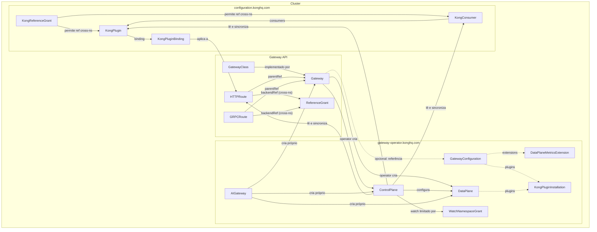

# Kong Operator: Como Funciona, Recursos e Diagrama de Dependências

O **Kong Operator** (KO) é a forma nativa em Kubernetes de implantar e gerenciar o Kong. Ele permite configurar o Kong Gateway de forma declarativa usando a **Gateway API** ou CRDs específicos do Kong (Konnect). Este artigo resume o funcionamento do operator, lista os recursos que podem ser criados (a partir de `kubectl api-resources` e `kubectl api-versions`) e traz um diagrama de dependências entre os objetos.

---

## O que é o Kong Operator?

O Kong Operator é um **operator Kubernetes** que:

- **Implanta e gerencia** instâncias do Kong Gateway (DataPlane) no cluster.
- **Reconcilia** recursos da Gateway API (como `Gateway`, `HTTPRoute`) e CRDs do Kong, gerando configuração no Kong.
- Suporta **Konnect** (control plane em nuvem) e modo **standalone** (tudo no cluster).
- Oferece **managed gateways**: ao criar um `Gateway`, o operator cria automaticamente um **ControlPlane** e um **DataPlane** para esse Gateway.

Referência: [Kong Operator – Documentação oficial](https://developer.konghq.com/operator).

---

## Como funciona: Managed Gateways

O Kong Operator trata o recurso **Gateway** (Gateway API) de forma diferente do Kong Ingress Controller. Essa abordagem é chamada de **managed gateways** ([Managed Gateways](https://docs.konghq.com/gateway-operator/latest/concepts/managed-gateways/)).

1. **Você cria um `Gateway`** (recurso da Gateway API) que referencia um `GatewayClass` implementado pelo Kong.
2. **O operator detecta o novo `Gateway`** e cria automaticamente:
   - **ControlPlane**: uma instância em memória do Kong Ingress Controller que reconcilia **apenas esse** Gateway.
   - **DataPlane**: um deployment do Kong Gateway que recebe o tráfego.
3. **Cada ControlPlane** reconcilia exatamente **um** Gateway.
4. **Configuração dinâmica**: o operator ajusta o DataPlane com base nos **listeners** do Gateway. Por exemplo:
   - Gateway com listener HTTP na porta 80 → o serviço de ingress do DataPlane expõe só a porta 80.
   - Se você adicionar um listener HTTPS na 443, o operator atualiza o DataPlane para expor também a 443.

Ou seja: você declara listeners no `Gateway`, e o Kong Operator cuida de criar e configurar ControlPlane + DataPlane de acordo.

---

## Fluxo de reconciliação (resumo)

- **Gateway** (usuário) → referência a **GatewayClass** (Kong).
- **Kong Operator** observa `Gateway` e cria **ControlPlane** + **DataPlane**.
- **ControlPlane** lê Gateway API (`HTTPRoute`, `GRPCRoute`, etc.) e CRDs Kong (`KongPlugin`, `KongConsumer`, etc.) e **sincroniza** a configuração para o **DataPlane** (Kong Admin API / declaração em DB).
- **DataPlane** (Kong Gateway) recebe o tráfego e aplica rotas, plugins e políticas.

Para Konnect, o operator ainda sincroniza entidades (consumers, plugins, etc.) com o control plane na nuvem. Detalhes: [Reconciliation loop](https://developer.konghq.com/operator/konnect/reconciliation-loop).

---

## Documentação oficial relevante

| Tópico | Link |
|--------|------|
| Kong Operator (visão geral) | [developer.konghq.com/operator](https://developer.konghq.com/operator) |
| Índice da documentação do Operator | [docs.konghq.com – Operator](https://docs.konghq.com/gateway-operator/latest/concepts/gateway-api/) |
| Managed Gateways | [Managed Gateways](https://docs.konghq.com/gateway-operator/latest/concepts/managed-gateways/) |
| Gateway Configuration | [Gateway configuration](https://developer.konghq.com/operator/dataplanes/gateway-configuration) |
| CRDs (referência) | [Custom resource definitions](https://developer.konghq.com/operator/reference/custom-resources) |
| Reconciliation loop (Konnect) | [Reconciliation loop](https://developer.konghq.com/operator/konnect/reconciliation-loop) |
| Instalação via Gateway API | [Install – Gateway API](https://developer.konghq.com/operator/get-started/gateway-api/install/) |
| Instalação via Konnect CRDs | [Install – Konnect CRDs](https://developer.konghq.com/operator/get-started/konnect-crds/install/) |

---

## Recursos disponíveis (kubectl api-resources e api-versions)

Os recursos abaixo foram obtidos com `kubectl api-resources` e `kubectl api-versions` em um cluster com Kong Operator instalado. Eles estão agrupados por **API group** e incluem a **função** de cada recurso.

### Versões da API do Kong Operator

```text
gateway-operator.konghq.com/v1alpha1
gateway-operator.konghq.com/v1beta1
gateway-operator.konghq.com/v2beta1
```

---

### gateway-operator.konghq.com (Kong Operator – core)

| Recurso | Nome curto | API Version | Escopo | Função |
|--------|------------|-------------|--------|--------|
| **ControlPlane** | `kocp` | v2beta1 | namespaced | Instância do Kong Ingress Controller que reconcilia **um** Gateway e envia configuração para o DataPlane. Criado automaticamente pelo operator quando um `Gateway` é criado. |
| **DataPlane** | `kodp` | v1beta1 | namespaced | Deployment do Kong Gateway que recebe o tráfego. O operator cria e atualiza o DataPlane com base no `Gateway` (listeners, etc.). |
| **GatewayConfiguration** | `kogc` | v2beta1 | namespaced | Configuração compartilhada para DataPlane/ControlPlane (imagem, plugins, opções). Pode ser referenciada pelo `Gateway` para customizar o Kong. |
| **DataPlaneMetricsExtension** | — | v1alpha1 | namespaced | Extensão de métricas do DataPlane. Anexada ao ControlPlane via `spec.extensions`; configura métricas no DataPlane e expõe métricas para autoscaling no Kubernetes. |
| **KongPluginInstallation** | `kpi` | v1alpha1 | namespaced | Instala plugin Kong customizado (imagem de container). Pode ser associado a **GatewayConfiguration** ou **DataPlane** para disponibilizar o plugin e configurá-lo via `KongPlugin`. |
| **WatchNamespaceGrant** | — | v1alpha1 | namespaced | Concede a um namespace “confiável” permissão para **observar** recursos no namespace onde o grant está definido (útil para limitar quais namespaces o ControlPlane enxerga). |
| **AIGateway** | — | v1alpha1 | namespaced | Gateway especial para AI/LLM: cria e gerencia um Gateway + DataPlane + consumers e plugins (ai-proxy, ai-prompt-guard, etc.) para expor modelos (ex.: LLMs) via Kong. |

---

### gateway.networking.k8s.io (Gateway API – padrão Kubernetes)

| Recurso | Nome curto | API Version | Escopo | Função |
|--------|------------|-------------|--------|--------|
| **Gateway** | `gtw` | v1 | namespaced | Recurso principal que representa um gateway de rede. Ao usar um GatewayClass do Kong, o Kong Operator cria ControlPlane + DataPlane para esse Gateway. |
| **GatewayClass** | `gc` | v1 | cluster | Define a “classe” do gateway (implementação). O Kong Operator registra um GatewayClass; Gateways que o referenciam são gerenciados pelo Kong. |
| **HTTPRoute** | — | v1 | namespaced | Define rotas HTTP associadas a um Gateway (hostnames, paths, backends). O ControlPlane traduz para configuração Kong. |
| **GRPCRoute** | — | v1 | namespaced | Define rotas gRPC associadas a um Gateway. |
| **ReferenceGrant** | `refgrant` | v1beta1 | namespaced | Permite referências cross-namespace (ex.: HTTPRoute no ns A referenciar Service no ns B). Necessário para backends em outros namespaces. |
| **BackendTLSPolicy** | `btlspolicy` | v1 | namespaced | Política TLS para backends (ex.: certificados para comunicação com serviços upstream). |

---

### configuration.konghq.com (configuração Kong)

| Recurso | API Version | Escopo | Função |
|--------|-------------|--------|--------|
| **KongPlugin** | v1 | namespaced | Define configuração de um plugin Kong. Pode ser anotado em Ingress/Service/HTTPRoute ou referenciado por KongPluginBinding. |
| **KongClusterPlugin** | v1 | cluster | Plugin em escopo de cluster; pode ser global (label `global`). Diferença principal: cluster-scoped e uso como plugin global. |
| **KongConsumer** | v1 | namespaced | Representa um consumer no Kong (autenticação, ACL, etc.). Pode referenciar credenciais (Secrets). |
| **KongConsumerGroup** | v1beta1 | namespaced | Agrupa consumers; usado para políticas e plugins por grupo. |
| **KongUpstreamPolicy** | v1beta1 | namespaced | Política de upstream (load balancing, health checks) aplicável a serviços. |
| **IngressClassParameters** | v1alpha1 | namespaced | Parâmetros da IngressClass (ex.: serviceUpstream, legacy regex). |
| **KongCACertificate** | v1alpha1 | namespaced | Certificado CA no Kong (ex.: para validação de client certificates ou upstreams). |
| **KongCertificate** | v1alpha1 | namespaced | Certificado TLS no Kong (ex.: para terminación TLS). |
| **KongCredentialACL** | v1alpha1 | namespaced | Credencial ACL associada a um consumer. |
| **KongCredentialAPIKey** | v1alpha1 | namespaced | Credencial de API Key para um consumer. |
| **KongCredentialBasicAuth** | v1alpha1 | namespaced | Credencial Basic Auth para um consumer. |
| **KongCredentialHMAC** | v1alpha1 | namespaced | Credencial HMAC para um consumer. |
| **KongCredentialJWT** | v1alpha1 | namespaced | Credencial JWT para um consumer. |
| **KongPluginBinding** | v1alpha1 | namespaced | Associa um KongPlugin a uma entidade (Route, Service, Consumer, etc.). |
| **KongReferenceGrant** | v1alpha1 | namespaced | Permite referências cross-namespace em recursos Kong (ex.: Secret ou consumer em outro namespace). |
| **KongRoute** | v1alpha1 | namespaced | Rota Kong nativa (JSON). Alternativa/complemento à HTTPRoute. |
| **KongService** | v1alpha1 | namespaced | Serviço Kong nativo. |
| **KongUpstream** | v1alpha1 | namespaced | Upstream Kong (load balancing, health checks). |
| **KongTarget** | v1alpha1 | namespaced | Target de um KongUpstream (instância backend). |
| **KongSNI** | v1alpha1 | namespaced | SNI associado a certificados no Kong. |
| **KongVault** | v1alpha1 | cluster | Vault para armazenar dados sensíveis referenciados por plugins. |
| **KongLicense** | v1alpha1 | cluster | Licença Enterprise do Kong; aplicada aos DataPlanes gerenciados. |
| **KongKeySet** | v1alpha1 | namespaced | Conjunto de chaves (ex.: JWT). |
| **KongKey** | v1alpha1 | namespaced | Chave individual (ex.: JWT). |
| **KongDataPlaneClientCertificate** | v1alpha1 | namespaced | Certificado de cliente do DataPlane (ex.: para Konnect). |
| **KongCustomEntity** | v1alpha1 | namespaced | Entidade customizada que o KIC não suporta nativamente; enviada como JSON para o Kong. |

---

### konnect.konghq.com (Konnect)

| Recurso | API Version | Escopo | Função |
|--------|-------------|--------|--------|
| **KonnectGatewayControlPlane** | v1alpha2 | namespaced | Control plane no Konnect (nuvem) referenciado pelo cluster. |
| **KonnectExtension** | v1alpha2 | namespaced | Configuração de extensão Konnect (ex.: registro do cluster no Konnect). |
| **KonnectAPIAuthConfiguration** | v1alpha1 | namespaced | Configuração de autenticação da API do Konnect. |
| **KonnectCloudGatewayDataPlaneGroupConfiguration** | v1alpha1 | namespaced | Configuração de grupo de DataPlane para Dedicated Cloud Gateways. |
| **KonnectCloudGatewayNetwork** | v1alpha1 | namespaced | Rede para Dedicated Cloud Gateways. |
| **KonnectCloudGatewayTransitGateway** | v1alpha1 | namespaced | Transit Gateway para Konnect Cloud Gateways. |

---

## Diagrama de dependências entre os objetos

O diagrama abaixo resume as dependências entre os principais recursos quando se usa o Kong Operator com **Gateway API** e **managed gateways**. Setas indicam “referencia” ou “é criado por”.



### Legenda rápida

- **GatewayClass** → **Gateway**: você cria um `Gateway` que usa o `GatewayClass` do Kong.
- **Gateway** → **ControlPlane** + **DataPlane**: o Kong Operator cria esses dois recursos para cada `Gateway`.
- **ControlPlane** → **DataPlane**: o ControlPlane envia configuração (rotas, plugins, consumers) para o DataPlane.
- **GatewayConfiguration**: opcional; referenciada pelo Gateway para customizar imagem, plugins (KongPluginInstallation) e extensões (ex.: DataPlaneMetricsExtension).
- **HTTPRoute/GRPCRoute**: referenciam o Gateway (`parentRef`) e definem backends; **ReferenceGrant** libera referências cross-namespace.
- **KongPlugin / KongConsumer / KongPluginBinding**: o ControlPlane lê esses recursos e sincroniza para o DataPlane (e, se configurado, para o Konnect).
- **KongReferenceGrant**: permite referências cross-namespace em recursos Kong (consumers, plugins, secrets).
- **WatchNamespaceGrant**: restringe em quais namespaces o ControlPlane pode observar recursos.
- **AIGateway**: recurso de alto nível que cria e gerencia seu próprio Gateway + DataPlane + ControlPlane para cenários de AI/LLM.

---

## Como listar os recursos no seu cluster

Para reproduzir a lista de recursos no seu ambiente:

```bash
# Todos os recursos Kong + Gateway API de uma vez
kubectl api-resources | grep -E "konghq|gateway\.networking"

# Recursos apenas do Kong Operator (core)
kubectl api-resources --api-group=gateway-operator.konghq.com

# Recursos de configuração Kong
kubectl api-resources --api-group=configuration.konghq.com

# Recursos da Gateway API
kubectl api-resources --api-group=gateway.networking.k8s.io

# Versões disponíveis (api-versions)
kubectl api-versions | grep konghq
```

Isso ajuda a confirmar quais CRDs estão instalados e em quais versões (v1alpha1, v1beta1, v2beta1, etc.).

---

## Conclusão

O Kong Operator oferece um modelo **managed gateways** em que um único recurso **Gateway** dispara a criação e a configuração de **ControlPlane** e **DataPlane**. Os objetos listados aqui cobrem o core do operator (`gateway-operator.konghq.com`), a Gateway API (`gateway.networking.k8s.io`), a configuração Kong (`configuration.konghq.com`) e o Konnect (`konnect.konghq.com`). O diagrama de dependências resume como esses recursos se relacionam na prática. Para detalhes de cada CRD, use a [referência oficial de CRDs](https://developer.konghq.com/operator/reference/custom-resources) e a documentação do [Kong Operator](https://developer.konghq.com/operator).
